# Active-Automation V.3.1 🚀🌐💻

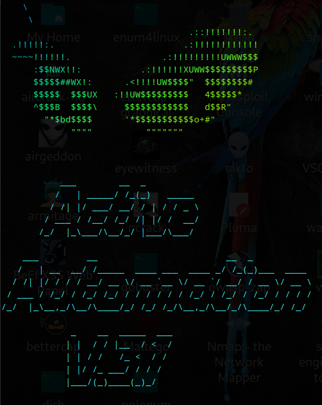

Active-Automation is a powerful and comprehensive tool that automates the active information gathering process, utilizing the best tool for scanning, Nmap 🔍. It features a variety of scripts ranging from basic to complex, ensuring it meets the needs of both beginners and advanced users in penetration testing and cybersecurity 👨‍💻🎯.

📋 **Table of Contents** 📋

- Project Overview 📝
- Features ✨
- Installation Guide 📦
- Usage Instructions 📜
- Technologies Used ⚙️
- License 📃
- Author & Contact 📧
- Demo / Screenshots 📸
- Example Use Cases 💡
- Security Disclaimer ⚠️

## Project Overview 📝

**Name**: Active-Automation V.3.1 🚀
**Work**: Automates the active information gathering process using Nmap ⚡. It comes with several scripts, ranging from basic to advanced scans, and offers a variety of options to customize the scanning process 🔄.

## Features ✨

### 1️⃣ **Main Scripts** 🗂️

- **Comprehensive Automation** 🕵️‍♂️ (Best for initial scanning) 🏁
- **Perform Individual Scans Automation** 🔍 (Perform specific scans based on the user's needs) 🧩
- **Advanced & Specialized Scans Automation** 🎯 (For deeper and more complex scanning) 💣
- **Speedy-X Scan** 🚀 (Recommended if speed is critical ⚡)
- **Modify Target Selection** 🔄 (Change targets easily) 🔄
- **Exit** ⏹️

### 2️⃣ **Sub Scripts** 🔧

#### 1. **Comprehensive Automation** 🕵️‍♂️

- Gathers information including:
  1. Ping scan
  2. Scan 1000 ports ⚙️
  3. Service detection 🔎
  4. OS detection 🌍
  5. Script scan 📝

#### 2. **Individual-X Scan** 🔍

1. Ping scan automation (Check if host is online 🌐)
2. Simple port scan automation (Top 1000 ports ⚡)
3. OS detection automation (Basic OS guessing 🧠)
4. Service version detection automation (Basic services 🔧)
5. Default Nmap scripts scan automation 🖥️
6. Return to main menu or exit ⏹️

#### 3. **Advanced-X Scan** 🎯

1. Aggressive scan (OS, Services, Traceroute) – **Slowest** ⏳
2. Full port scan (65535 ports) – **Slowest** ⏳
3. Evade firewall (Decoy IPs) – **Slower** ⏳
4. TCP SYN scan (Stealth) – ⚡ **Faster** ⏳
5. Scan specific ports – ⚡ **Fast** ⏳
6. Check UDP ports – 🐌 **Slower** ⏳
7. Detect firewall rules – 🐢 **Slow** ⏳
8. Scan for vulnerabilities (NSE) – 🐌 **Slowest** ⏳
9. Detect live hosts (No pings) – 🐌 **Slowest** ⏳
10. Scan with custom timing – 🚀 **Fastest** ⏳
11. Return to main menu or exit ⏹️

#### 4. **Speedy-X Scan** 🚀

1. Ping scan automation (Check if host is online 🌐)
2. Simple port scan automation (Top 1000 ports ⚡)
3. OS detection automation 🌍
4. Service version detection 🔧
5. Default Nmap -T4 scripts scan automation 🖥️
6. Aggressive scan (OS, Services, Traceroute) 🏁
7. Full port scan (65535 ports) 🛠️
8. Evade firewall (Decoy IPs) 🛡️
9. TCP SYN scan (Stealth) 🥷
10. Scan specific ports 🧭
11. Check UDP ports 🐌
12. Detect firewall rules 🔒
13. Scan for vulnerabilities (NSE) 💥
14. Detect live hosts 🖥️
15. Scan with custom timing 🕒
16. Single port scan 📍
17. Exit ⏹️

### 5️⃣ **Other Features** 🎉

1. **Colorful output 🌈**
2. **Animation used 🎬**
3. **Error handling ⚠️**
4. **Looping feature (no need to restart, just say "yes" to scan more 🔁)**
5. **Save capability with user-defined name, path, and format (log, txt, xml, md 📄)**
6. **Target change feature 🔄**
7. **Easy to use, high visual readability 👁️**
8. **Quotes used to keep it fun and engaging 🗣️**
9. **Preview ongoing scans or show results only 👀**
10. **Check if the target is online before starting scans 📶**

## Installation Guide 📦

To get started, follow these steps:

**1):Install dependencies**:

```bash

sudo apt-get update  
sudo apt-get install cowsay lolcat nmap  
```

 **2):Clone the 📂 repository**:

```bash
   git clone https://github.com/mizazhaider-ceh/active-automation.git  
```

 **3):📂 Navigate to the 🖥️ directory:**:

```bash
    cd active-automation
```

 **4):✅ Grant execution permissions:**:

```bash
    chmod +x active-automation.sh
```

 **5):▶️ Run the 🖥️:**:

```bash
    ./active-automation.sh
```

 **6):⌨️ Enter the 🎯 domain when prompted and follow the 📺 on-screen instructions.**

## Technologies Used ⚙️

* **Bash programming** 💻
* **Nmap🎯**
* **VS Code** 🖥️
* **Linux Terminal** (Parrot OS, Kali Linux) 🐧
* **Metaspoitable 2 (Target)**

## Demo / Screenshots 📸

Below are the screenshots of the various scripts and functions in Active-Automation V.3.1:

* **Logo**
* 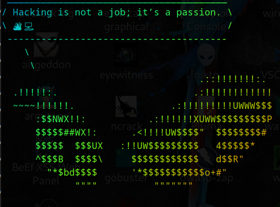 
* **Main Menu Screenshot** 📷
* 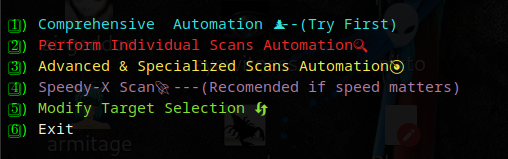 
* **Subscript - Comprehensive Automation (Logo)**
*  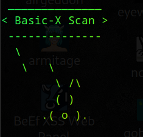 
* **Subscript - Comprehensive Automation (Result)**
*   
* **Subscript - Individual-X Scan (Logo)🔍**
*   
* **Subscript - Individual-X Scan (Menu)🔍**
*  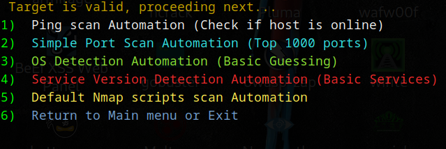 
* **Subscript - Advanced-X Scan(Logo) 🎯**
*  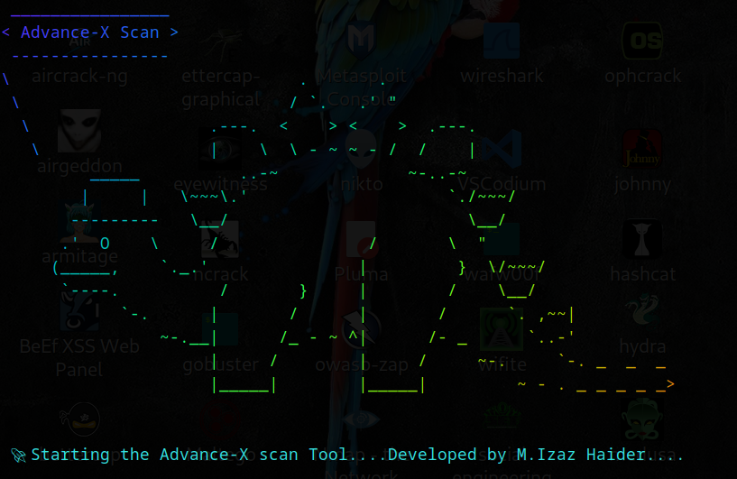 
* **Subscript - Advanced-X Scan(Menu) 🎯**
*  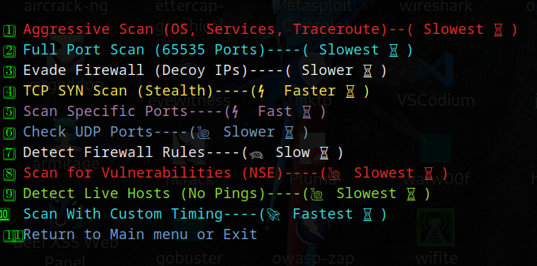 
* **Speedy-X Scan(Logo) 🚀**
*  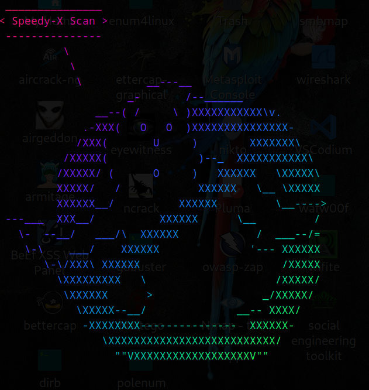 
* **Speedy-X Scan(Menu) 🚀**
*  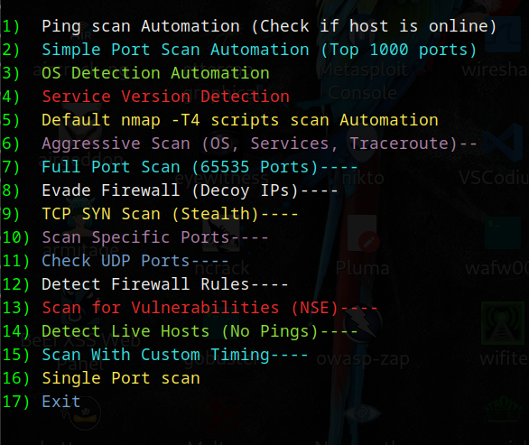 
* **Running**
*  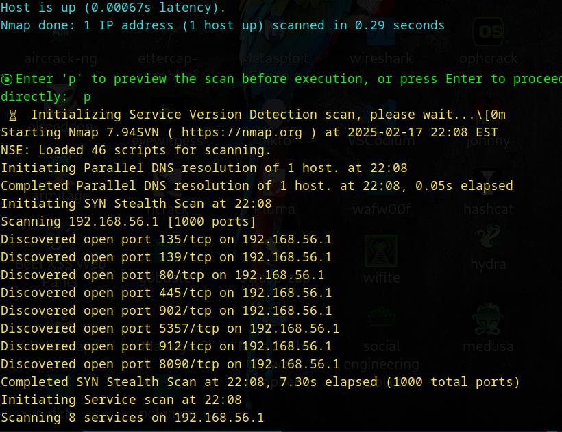 
* **Saving Scan Output** 💾
*  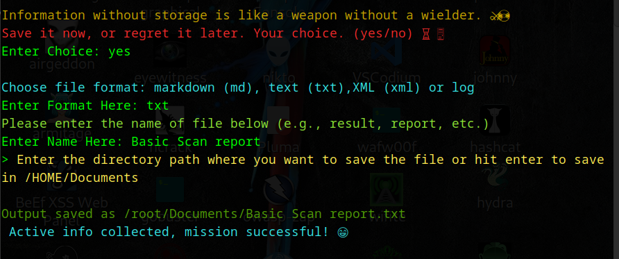 
* **Target Checking**
*  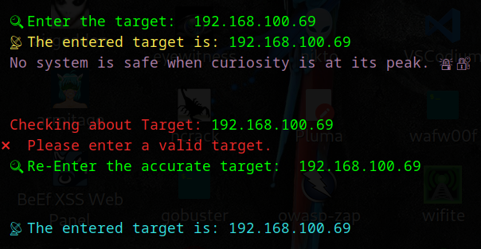 
* **Changing tha Target**
*  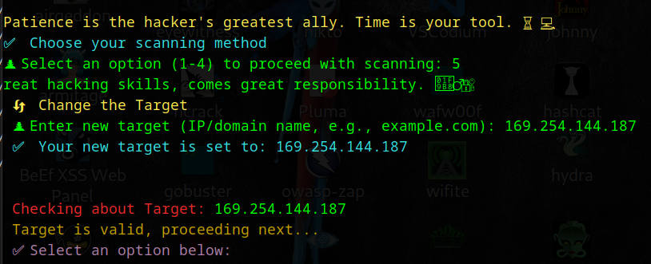 

## Example Use Cases 💡

* Used for scanning vulnerable labs like Metasploitable for hands-on experience in a legal boundary 🧪.
* Ideal for penetration testers, bug hunters 🐞, or beginners who want a reliable tool for automating Nmap scans 🔐.

## 🌟 Benefits of Active-Automation V.3.1

1. **Comprehensive Automation 🕵️‍♂️**Automates the entire active information gathering process, from scanning to service detection, ensuring efficiency and speed.
2. **User-Friendly Interface 🖥️**With a clean and simple interface, users can easily navigate and perform different scans without needing advanced knowledge.
3. **Customizable Scanning Options 🔧** Offers a variety of scanning options, from basic to advanced scans, tailored to meet the needs of penetration testers and cybersecurity enthusiasts.
4. **Speedy Scans 🚀** The Speedy-X scan is optimized for faster results, ideal for when time is of the essence during security assessments.
5. **Advanced Scanning Features 🎯** Includes options like aggressive scanning, full port scanning, evading firewalls, and vulnerability scanning, providing comprehensive insights into the security of a target.
6. **Flexible Output Formats 💾** Save the scan results in multiple formats like log, txt, xml, or markdown, ensuring compatibility with various analysis tools.
7. **Continuous Scanning 🌀** The looping feature allows you to continuously perform scans without needing to restart the tool, making it convenient for repeated testing.
8. **Error Handling ⚠️**Built-in error handling ensures smooth operation and troubleshooting, even when unexpected issues arise.
9. **Legal and Ethical Usage ✅** Designed for ethical hacking and educational purposes, ensuring that users can improve their skills within legal boundaries.
10. **Educational Tool 📚**
    Great for beginners and penetration testers who want to learn and automate Nmap scans with minimal setup and complexity.

## Security Disclaimer ⚠️

🚨 This tool is for educational and ethical purposes only. Misuse may lead to legal consequences ⚖️. Use it responsibly and only on systems you have permission to test ✅.

## License 📃

MIT License - See the LICENSE file for details 📄.

## Author & Contact 📧

 **Author** : Muhammad Izaz Haider (Penetration Tester / Developer) 👨‍💻
 **Email** : [mizazhaiderceh@gmail.com]() ✉️
 **LinkedIn** : [Muhammad Izaz Haider 🌐](https://www.linkedin.com/in/muhammad-izaz-haider-091639314/)
